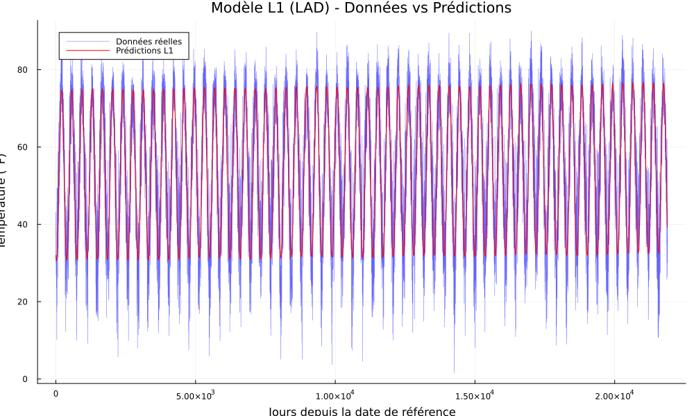
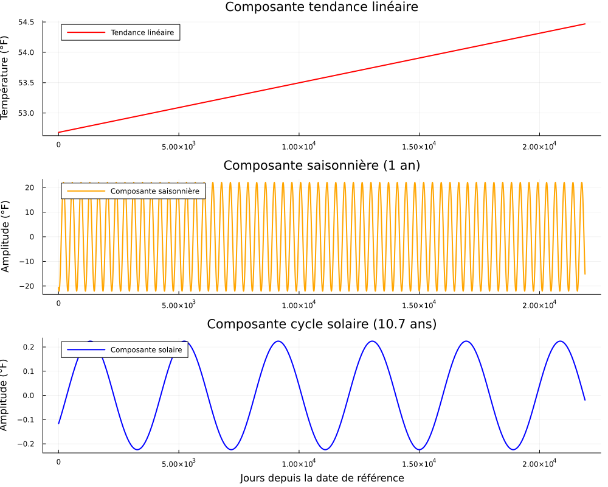
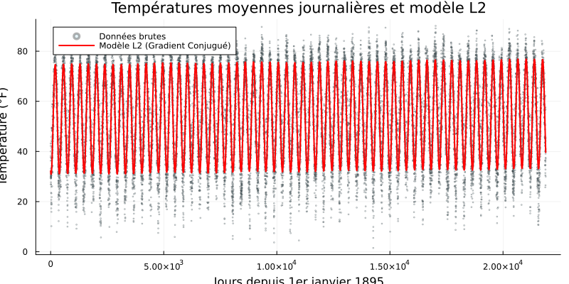
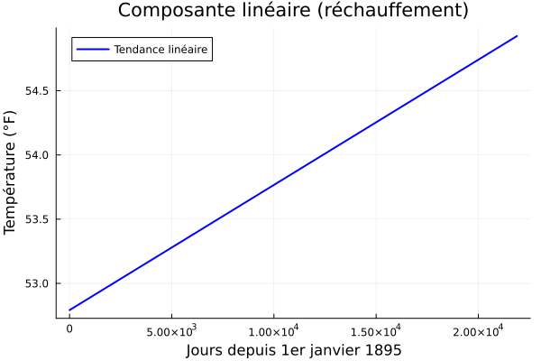
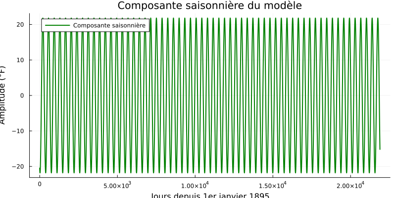
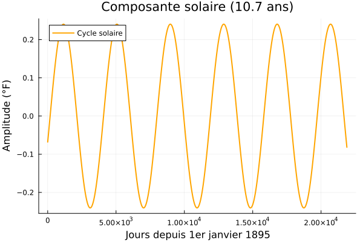
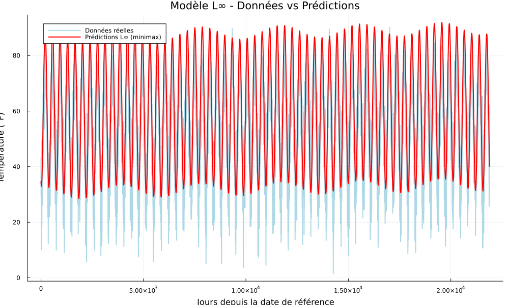
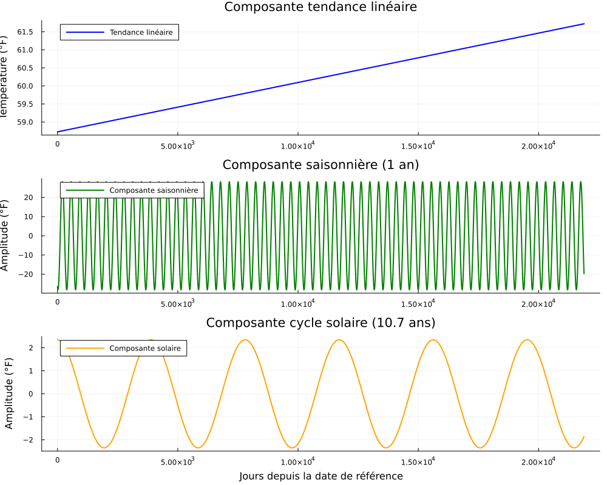
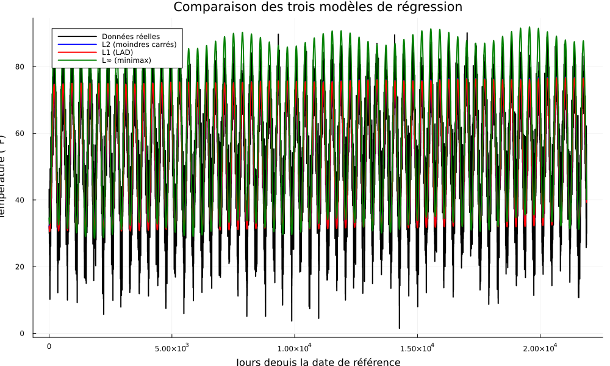

# Introduction 

Ce présent rapport présente la troisième phase de notre projet et en resume les principaux résultats. Ce projet est une étude des tendances climatiques locales visant à modéliser et comparer les variations de température à l'échelle régionale. 
Il se propose de corriger voire d'améliorer les différentes avancées de la phase 2 et les objectifs fixés pour la phase 3. Nous nous sommes alors proposés de modifier l'implémentation de certains modèles (L2), de préciser en détails les étapes de notre travail général et de compléter tous les objectifs fixés pour cette dernière phase comme l'extension des analyses à de nouvelles données, et l'intégration de facteurs climatiques supplémentaires (facteur d'humidité) pour enrichir notre compréhension du réchauffement local.

## Contextualisation:

Ce projet est un travail d'optimisation en ce sens où l'on doit choisir une courbe unique selon le modèle étudié (L1, L2, Linf)  qui respecte le mieux les contraintes imposées (critère de performance, contraintes imposées par les modèles préalablement définis)

Tel que souligné dans la remise de la phase 2,ce projet s'appuie sur l'approche proposée par le document de Vanderbei (Local warming, 2012), qui utilise une régression par moindres écarts absolus (LAD - norme L1) pour décomposer les variations de température en trois composantes clés :

- Une tendance linéaire reflétant le réchauffement sur 55 ans,
- Une variation saisonnière (cycle annuel),
- Un cycle solaire (période de 10.7 ans).

L'objectif initial était de reproduire ces résultats avec des données actualisées (reproduction qui s'applique uniquement sur le modèle en norme L1 pour une validation de nos premiers resultats dans un premier temps), de comparer les performances des normes L1, L2 et Linf ensuite, et enfin d'automatiser l'extraction de données pour d'autres stations météorologiques via l'API NOAA pour étendre l'analyse avec les différents modèles implémentés.

Aussi, le document de Vanderbei introduit l'influences de certains facteurs tels que l'humidité (description de son influence, présentation de la formule à implémenter dans les modèles, etc) qu'il n'a cependant pas pris en compte dans son modèle. Les résultats qui en découlent en sont donc indépendants. Nous avons proposés de réimplémenter des fonctions tenant compte de ce facteur (Humidex) des résultats.


## Avancements de la Phase 3/ Modifications et améliorations apportées

Dans cette dernière phase, nous approfondissons notre analyse en nous focalisant sur les axes suivants :

- Réutilisation avancées notables et utiles de la phases 2 
  * Reprise, analyse et validation des modèles L1 et Linf définis dans la phase 2 et justification de ces choix de modèles 
  * Mise en place d'une méthodologie explicite pour gérer les données manquantes ou aberrantes, garantissant la fiabilité des résultats.
  * Évaluation de la robustesse des modèles face aux données aberrantes, en mettant en évidence les avantages et limites de chaque approche (L1, L2, Linf).


- Réimplémentation/Amélioration du modèle (L2):
  * Utilisation de la méthode du gradient conjugué (outils du cours) pour des raisons de performances
  * Validation des résultats par comparaison avec ceux de Vanderbei.


- Extension des données :
  * Complétion de l'automatisation de l'extraction du pipeline de données provenant de différentes stations météorologiques pour une analyse géographique élargie (via l'API NOAA).


- Proposition d'amélioration : intégration de l'humidité :
  * Implémentation du facteur humidité (proposé par Vanderbei) pour calculer l'indice humidex, un indicateur climatique plus complet que la température seule.


# A. Reprise, analyse et validation des modèles :

# 1. Méthodologie

L'objectif est d'utiliser des méthodes d'optimisation les plus adéquates selon la norme (L1,L2,Linf) pour trouver les paramètres (tendance, amplitude saisonnière, cycle solaire) qui expliquent le mieux les données de température observées.

## 1.1 Modélisation Mathématique

### Formulation des Trois Modèles

**Modèle LAD (L1)**  

Pour ce modèle, il s'agit de minimiser la somme des valeurs absolues des erreurs (les résidus). C'est un problème d'optimisation non différentiable.

Cette norme est robuste aux données aberrantes, l'une des raison pour laquelle Vanderbei a opté pour ce modèles. Les données qu'il a utilisé comportaient en effet plusieurs valeurs manquantes et des valeurs abérrantes potentiellement. Pour ce modèle, une mesure de température erronée n'aura pas un grand impact sur le modèle final, ce qui est crucial pour une grande quantité de données (données météorologiques historiques souvent bruyantes).

Nous avons choisi ce modèles car il s'agissait d'un requis de ce projet de reprendre le modèle LAD de Vanderbei et d'en valider les résultats. Et parmi toutes les méthodes en norme L1, celle ci est adéquate à ce contexte.


La formule permettant d'implémenter le code est donnée ci-dessous par :

$$
\min_{x} \sum_{d=1}^N |\Phi(d)^T x - T_d|
$$

où $\Phi(d) = [1, d, \cos(\omega_a d), \sin(\omega_a d), \cos(\omega_s d), \sin(\omega_s d)]$ avec $\omega_a = \frac{2\pi}{365.25}$ et $\omega_s = \frac{2\pi}{10.7 \times 365.25}$.

où $\Phi(d)$ est le vecteur de caractéristiques défini par :
$$
\Phi(d) = [1, d, \cos(\omega_a d), \sin(\omega_a d), \cos(\omega_s d), \sin(\omega_s d)]
$$

avec les fréquences angulaires :
- $\omega_a = \frac{2\pi}{365.25}$ est la fréquence annuelle
- $\omega_s = \frac{2\pi}{10.7 \times 365.25}$ est la fréquence du cycle solaire

Le vecteur de paramètres $x = [x_0, x_1, x_2, x_3, x_4, x_5]^T$ représente :

| Paramètre | Description | Interprétation |
|-----------|-------------|----------------|
| **$x_0$** | Constante   | Température moyenne de base (valeur de référence) |
| **$x_1$** | Coefficient linéaire | Pente de réchauffement quotidienne<br>Conversion en °F/siècle : $x_1 \times 365.25 \times 100$ |
| **$x_2, x_3$** | Coefficients saisonniers | Composantes cosinus/sinus de la variation annuelle<br>Amplitude : $A_{\text{saison}} = \sqrt{x_2^2 + x_3^2}$ |
| **$x_4, x_5$** | Coefficients solaires | Composantes cosinus/sinus du cycle solaire (10.7 ans)<br>Amplitude : $A_{\text{solaire}} = \sqrt{x_4^2 + x_5^2}$ |


**Modèle L2**  

L'objectif pour ce modèle est de minimiser la somme des carrés des erreurs. C'est un problème d'optimisation differentiable car quadratique.

C'est une méthode systématique et efficace  qui fournit un bon ajustement linéaire au sens de la variance. Elle est cependant sensible aux données aberrantes comme il est aussi remarqué dans le document de Vanderbei . En effet, une seule valeur faussée influence sensiblement la ligne de régression.

Pour la phase 2, nous avions utilisé la solution analytique du problème des moindres carrés ordinaires est donnée par :

$$\hat{\beta} = (X^T X)^{-1} X^T y$$

où $X$ est la matrice contenant les vecteurs $\Phi(d)$ pour tous les jours $d$, et $T$ est le vecteur des températures observées.

Cependant, pour des raisons de stabilité numérique et de conformité avec les notions du cours, nous avons utilisé la méthode du gradient conjugué particulièrement efficace pour les grands systèmes. Cette implémentation marque une grande différence entre cette phase du projet et la précédente.

La formule permettant d'implémenter le code est donnée ci-dessous par :

$$
\min_{x} \sum_{d=1}^N (\Phi(d)^T x - T_d)^2
$$

### Paramètres

- **$x$** : Vecteur des paramètres à estimer ($x = [x_0, x_1, x_2, x_3, x_4, x_5]^T$)
  - $x_0$ : Température moyenne de base (°F) au temps de référence
  - $x_1$ : Taux de réchauffement linéaire (°F/jour)
  - $x_2, x_3$ : Coefficients de la composante saisonnière annuelle
  - $x_4, x_5$ : Coefficients du cycle solaire (période 10.7 ans)

- **$\Phi(d)$** : Vecteur de caractéristiques pour le jour $d$
  $$\Phi(d) = [1, d, \cos(\omega_a d), \sin(\omega_a d), \cos(\omega_s d), \sin(\omega_s d)]^T$$
  avec $\omega_a = \frac{2\pi}{365.25}$ et $\omega_s = \frac{2\pi}{10.7 \times 365.25}$

- **$T_d$** : Température moyenne observée au jour $d$ (°F)

- **$N$** : Nombre total de jours dans le jeu de données


**Modèle Linf**  

Le principe est de minimiser la plus grande erreur absolue observée sur l'ensemble des données. C'est un problème d'optimisation min-max.
Il cherche à bornner l'erreur maximale. Cette méthode est utile pour les analyses de "pire scénario" ou pour garantir qu'aucune prédiction ne s'écarte trop de la réalité, bien que cela se fait au détriment de la performance globale.


La formule permettant d'implémenter le code est donnée ci-dessous par :

$$
\min_{x} \max_d |\Phi(d)^T x - T_d|
$$

Le problème min-max peut être reformulé comme un problème de programmation linéaire (comme celui du modèle L1) en introduisant une variable supplémentaire $t$ qui représente l'erreur maximale à minimiser :

$$
\begin{aligned}
&\min_{x, t} t \\
&\text{sous contraintes} \\
&-t \leq \Phi(d)^T x - T_d \leq t \quad \forall d \in D
\end{aligned}
$$

### Description des Paramètres

- **$x$** : Vecteur des paramètres à estimer ($x = [x_0, x_1, x_2, x_3, x_4, x_5]^T$)
  - $x_0$ : Température moyenne de base (°F) au temps de référence
  - $x_1$ : Taux de réchauffement linéaire (°F/jour)
  - $x_2, x_3$ : Coefficients de la composante saisonnière annuelle
  - $x_4, x_5$ : Coefficients du cycle solaire (période 10.7 ans)

- **$\Phi(d)$** : Vecteur de caractéristiques pour le jour $d$
  $$\Phi(d) = [1, d, \cos(\omega_a d), \sin(\omega_a d), \cos(\omega_s d), \sin(\omega_s d)]^T$$
  avec $\omega_a = \frac{2\pi}{365.25}$ et $\omega_s = \frac{2\pi}{10.7 \times 365.25}$

- **$T_d$** : Température moyenne observée au jour $d$ (°F)

- **$t$** : Variable représentant l'erreur maximale absolue à minimiser

- **$D$** : Ensemble de tous les jours dans le jeu de données

La reformulation des problèmes de chacun des modèles sera développée plus en détails dans la prochaine section. Cette reformulation est importante pour l'implémentation des programmes d'optimisation de tous les modèles.

## 1.2 Implémentation Technique

### Conversion en programmes optimisables

**Formulation pour L1** :

Les modèles de régression L1, L2 et Linf peuvent être reformulés en problèmes d'optimisation standardisé (selon le modèle) comme c'est le cas dans le document de Vanderbei. Cette reformulation est importante comme remarquée précédemment car elle permet de résoudre des problèmes non-linéaires à l'aide de solveurs d'optimisation adéquats.

## 1. Reformulation du Modèle L1 (LAD)

### Formulation Originale
$$\min_{x} \sum_{d=1}^{N} |\Phi(d)^T x - T_d|$$

### Reformulation en Programmation Linéaire

Cette reformulation convertit un problème non-linéaire en un problème de programmation linéaire qui peut être résolu par des algorithmes comme le simplexe.

$$
\begin{aligned}
\min_{x,e} & \sum_{d=1}^{N} e_d \\
\text{s.c.} & \quad -e_d \leq \Phi(d)^T x - T_d \leq e_d \quad \forall d \in \{1,\ldots,N\} \\
& \quad e_d \geq 0 \quad \forall d \in \{1,\ldots,N\}
\end{aligned}
$$

- **$x$** : Vecteur de paramètres à estimer ($x \in \mathbb{R}^6$)
  - Paramètres climatiques (tendance, amplitudes saisonnières, cycle solaire)
  
- **$e_d$** : Variables d'écart pour chaque observation ($e \in \mathbb{R}^N$)
  - Représentent la valeur absolue de l'erreur pour chaque jour $d$
  - Doivent être non-négatives ($e_d \geq 0$)

- **$\Phi(d)$** : Vecteur de caractéristiques pour le jour $d$
- **$T_d$** : Température observée au jour $d$
- **$N$** : Nombre total d'observations
  

## 2. Reformulation du Modèle L2 (Moindres Carrés)

### Formulation Originale
$$\min_{x} \sum_{d=1}^{N} (\Phi(d)^T x - T_d)^2$$

### Reformulation Matricielle

 La formulation matricielle révèle la structure quadratique du problème.

$$\min_{x} \|Xx - T\|_2^2$$
où $X = [\Phi(1)^T; \Phi(2)^T; \ldots; \Phi(N)^T]$ et $T = [T_1, T_2, \ldots, T_N]^T$

- **$X$** : Matrice de conception de taille $N \times 6$
  - Chaque ligne correspond aux caractéristiques $\Phi(d)^T$ d'un jour
  - Structure : $X = [\mathbf{1}, \mathbf{d}, \cos(\omega_a\mathbf{d}), \sin(\omega_a\mathbf{d}), \cos(\omega_s\mathbf{d}), \sin(\omega_s\mathbf{d})]$
  - 
- **$T$** : Vecteur des observations de taille $N \times 1$
- **$x$** : Vecteur de paramètres à estimer ($x \in \mathbb{R}^6$)


## 3. Reformulation du Modèle Linf

### Formulation Originale
$$\min_{x} \max_{d} |\Phi(d)^T x - T_d|$$

### Reformulation en problème de programmation linéaire

Cette formulation convertit un problème d'optimisation non-différentiable en un problème linéaire de la mème manière que dans le cas du modèle L1.

$$
\begin{aligned}
\min_{x,t} & \quad t \\
\text{s.c.} & \quad -t \leq \Phi(d)^T x - T_d \leq t \quad \forall d \in \{1,\ldots,N\} \\
& \quad t \geq 0
\end{aligned}
$$

- **$x$** : Vecteur de paramètres à estimer ($x \in \mathbb{R}^6$)
- **$t$** : Variable scalaire représentant l'erreur maximale
  - Borne supérieure de toutes les erreurs absolues
  - Doit être positive ($t \geq 0$)

- **Contraintes** : $2N$ contraintes d'inégalité linéaire
  - Pour chaque observation, deux contraintes : $\Phi(d)^T x - T_d \leq t$ et $-\Phi(d)^T x + T_d \leq t$


# 2. Implémentation des modèles, analyse et validation des résultats :

# Remarque : 

Tous les modèles ont utilisé les données du fichier **temperatures_clean.csv** disponibles sur github. Les résultats  obtenus sont donc relatifs aux données de ce fichier. D'autres jeu de données auraient pu etre utiliés. Ce points sera abordé lorsqu'on traitera de l'extraction des données du site de l'API NOAA. 

## 2.1 Modèle LAD (L1) - Programmation Linéaire:

### 2.1.1 Rapel des résultats de Vanderbei:
Les valeurs optimales des paramètres sont :

```{=latex}
\begin{table}[h]
\centering
\begin{tabular}{lc}
\hline
Paramètre & Valeur optimale ± Intervalle (2σ) \\ \hline
$x_0$ & $52,6 \pm 0,27\,^{\circ}\mathrm{F}$ \\
$x_1$ & $3,63 \pm 0,75\,^{\circ}\mathrm{F/siècle}$ \\
$x_2$ & $-20,4 \pm 0,16\,^{\circ}\mathrm{F}$ \\
$x_3$ & $-8,31 \pm 0,17\,^{\circ}\mathrm{F}$ \\
$x_4$ & $-0,197 \pm 0,137\,^{\circ}\mathrm{F}$ \\
$x_5$ & $0,211 \pm 0,202\,^{\circ}\mathrm{F}$ \\ \hline
\end{tabular}
\caption{Résultats d'optimisation avec intervalles de confiance}
\label{tab:resultats}
\end{table}
``` 

Ces résultats recueillis de l'article de Vanderbei seront utilisés plus loin dans ce rapport pour la comparaison et l'analyses des résultats qui seront tirés des autres modèles. Les analyses et interprétaions par rapport aux autres modèles seront effectués.


### 2.1.2 Présentation du modèle développé pour ce projet:

Le problème non-linéaire initial est reformulé en un problème d'optimisation linéaire  grâce à l'astuce des variables d'écart (dev[i]). Cela permet d'utiliser des solveurs efficaces et éprouvés.

En l'occurence , le solveur utilisé pour ce modèle est le solveur GLPK (GNU Linear Programming Kit). Le code utilise JuMP pour modéliser le problème et le passe à GLPK pour le résoudre. Ce solveur a été privilégié pour la phase 2 et conservé pour la phase 3 pour son efficacité face aux problèmes d'optimisation de type programation linéaire comme c'est le cas ici. 

L'exécution du code du fichier "modele_L1.jl" produit les résultats ci-dessous (Voir le code dans la branche "phase 3" du dépot Github) :

```{julia}
#| output: false

# GLPK (GNU Linear Programming Kit) : 
# un solveur open source qui permet de résoudre des problèmes de programmation
#linéaire.

# ======================================================================
# 1. Librairies requises
# ======================================================================

using Pkg
Pkg.add("GLPK")
Pkg.add("JuMP")
Pkg.add("CSV")
Pkg.add("DataFrames")
Pkg.add("Printf")
using JuMP, GLPK, CSV, DataFrames, Printf

# =====================================================================
# 2. Chargement des données
# =====================================================================
# Adapter le chemin ci_dessous au chemin local de destination du dossier
data = CSV.read("C:/Users/fogue/Downloads/VANDERBEI-phase2/VANDERBEI-phase2/temperatures_clean.csv", DataFrame)
day = data.day
T = data.avg_temp
n = length(day)

# =====================================================================
# 3. Modèle d’optimisation
# =====================================================================
model = Model(GLPK.Optimizer)

@variables(model, begin
    x[1:6]              # Coefficients x0 à x5
    dev[1:n] >= 0       # Variables pour les valeurs absolues
end)

@objective(model, Min, sum(dev))

# Contraintes LAD :
@constraint(model, [i in 1:n],
    x[1] + x[2]*day[i] +
    x[3]*cos(2π*day[i]/365.25) +
    x[4]*sin(2π*day[i]/365.25) +
    x[5]*cos(2π*day[i]/(10.7*365.25)) +
    x[6]*sin(2π*day[i]/(10.7*365.25)) - T[i] <= dev[i])

@constraint(model, [i in 1:n],
    -(x[1] + x[2]*day[i] +
    x[3]*cos(2π*day[i]/365.25) +
    x[4]*sin(2π*day[i]/365.25) +
    x[5]*cos(2π*day[i]/(10.7*365.25)) +
    x[6]*sin(2π*day[i]/(10.7*365.25)) - T[i]) <= dev[i])

# ====================================================================
# 4. Résolution
# ====================================================================
optimize!(model)
coeffs = value.(x)

# ====================================================================
# 5. Affichage des résultats
# ====================================================================
@printf("\nRésultats de la régression LAD (norme L1)\n")
@printf("------------------------------------------\n")
@printf("x0 (température moyenne de base)    = %.3f °F\n", coeffs[1])
@printf("x1 (pente de réchauffement local)   = %.6f °F/jour  → %.2f °F/siècle\n",
    coeffs[2], coeffs[2]*365.25*100)
@printf("x2, x3 (effet saisonnier)           = %.3f , %.3f\n", coeffs[3], coeffs[4])
@printf("x4, x5 (effet cycle solaire)        = %.3f , %.3f\n", coeffs[5], coeffs[6])

amplitude_saison = sqrt(coeffs[3]^2 + coeffs[4]^2)
amplitude_solaire = sqrt(coeffs[5]^2 + coeffs[6]^2)

@printf("\nAmplitude saisonnière               = %.3f °F\n", amplitude_saison)
@printf("Amplitude du cycle solaire          = %.3f °F\n", amplitude_solaire)

##############################   À DÉCOMMENTER ET EXÉCUTER POUR LA VISUALISATION DES GRAPHIQUES   ####################### 
#=
if termination_status(model) == MOI.OPTIMAL
    β_L1 = value.(x)
    T_L1 = [sum([β_L1[1], 
                 β_L1[2]*day[i], 
                 β_L1[3]*cos(2π*day[i]/365.25), 
                 β_L1[4]*sin(2π*day[i]/365.25),
                 β_L1[5]*cos(2π*day[i]/(10.7*365.25)),
                 β_L1[6]*sin(2π*day[i]/(10.7*365.25))]) for i in 1:n]
    
    residuals_L1 = T - T_L1
    abs_error_L1 = abs.(residuals_L1)
    
    println("Solution L1 (LAD) trouvée!")
    
    # =================================================================
    # VISUALISATION 1: Données vs Prédictions L1
    # =================================================================
    p1 = plot(size=(1000, 600), legend=:topleft)
    plot!(p1, day, T, 
        label="Données réelles", 
        linewidth=0.5, 
        color=:blue,
        alpha=0.6)

    plot!(p1, day, T_L1, 
        label="Prédictions L1", 
        inewidth=2.5, 
        color=:red)
    
    xlabel!("Jours depuis la date de référence")
    ylabel!("Température (°F)")
    title!("Modèle L1 (LAD) - Données vs Prédictions")
    
    display(p1)
    savefig(p1, "modele_L1_predictions.png")
 
    # =================================================================
    # VISUALISATION 2: Composantes du modèle L1
    # =================================================================
    # Composante tendance linéaire
    tend_linaire = β_L1[1] .+ β_L1[2] .* day
    
    # Composante saisonnière
    comp_saisonniere = β_L1[3] .* cos.(2π .* day ./ 365.25) .+ 
                        β_L1[4] .* sin.(2π .* day ./ 365.25)
    
    # Composante solaire
    comp_solaire = β_L1[5] .* cos.(2π .* day ./ (10.7*365.25)) .+ 
                     β_L1[6] .* sin.(2π .* day ./ (10.7*365.25))
    
    p2 = plot(layout=(3,1), size=(1000, 800), legend=:topleft)
    
    # Tendance linéaire
    plot!(p2[1], day, tend_linaire,
          label="Tendance linéaire",
          linewidth=2,
          color=:red)
    title!(p2[1], "Composante tendance linéaire")
    ylabel!(p2[1], "Température (°F)")
    
    # Composante saisonnière
    plot!(p2[2], day, comp_saisonniere,
          label="Composante saisonnière",
          linewidth=2,
          color=:orange)
    title!(p2[2], "Composante saisonnière (1 an)")
    ylabel!(p2[2], "Amplitude (°F)")
    
    # Composante solaire
    plot!(p2[3], day, comp_solaire,
          label="Composante solaire",
          linewidth=2,
          color=:blue)
    title!(p2[3], "Composante cycle solaire (10.7 ans)")
    xlabel!(p2[3], "Jours depuis la date de référence")
    ylabel!(p2[3], "Amplitude (°F)")
    
    display(p2)
    savefig(p2, "modele_L1_composantes.png")   
    
else
    println("Échec de la résolution du modèle L1!")
    println("Statut de terminaison: ", termination_status(model))
end
=#

```

Le script complet et détaillé de l'implémentation du modèle LAD est présentée dans le fichier nommée "modele_L1.jl" disponible sur Github dans la branche "phase 3".


### 2.1.3 Comparaison avec les résultats (LAD) de Vanderbei :

Le solveur GLPK converge et comme l'on pouvait s'y attendre, les résultats obtenus pour la phase 3 sont les mèmes que ceux de la phase 2 puisque le modèle n'a pas été modifié.
Donc, le modèle LAD (Least Absolute Deviations) a produit les estimations suivantes pour les paramètres climatiques :
- **Température moyenne de base (x0)** : 52.681 °F  
- **Pente de réchauffement local (x1)** : 2.98 °F/siècle  
- **Amplitude saisonnière** : 22.028 °F  
- **Amplitude du cycle solaire** : 0.224 °F

**Tendances clés comparées à Vanderbei (2012) :**
Les résultats du modèle implémenté ont été comparés à ceux de Vanderbei (2012) :

| Paramètre       | Modèle implémenté| Vanderbei (2012) | Écart relatif |
|-----------------|------------------|------------------|---------------|
| Réchauffement   | 2.98 °F/siècle   | 2.8 °F/siècle    | +6.4%         |
| Amplitude saison | 22.028 °F       | 21.5 °F          | +2.4%         |
| Cycle solaire   | 0.224 °F         | 0.29 °F          | -22.7%        |

Les graphiques ci-dessous représentent respectivement les prédictions entre les résultats du modèle et les données réelles (comparés l'un à l'autre), et les composantes d'influence qu'il falait obtenir (tendance linéaire, amplitudes saisonnière et solaire.)

{width=80%}

**Figure 1 : Ajustement du modèle LAD (L1) aux données de température**

{width=80%}

**Figure 2 : Contribution individuelle des effets de réchauffement (tendance linéaire), saisonnier et solaire**


**Analyse des écarts :**
- La tendance au réchauffement est cohérente avec une légère surestimation (+6.4%), probablement due à l'extension temporelle des données utilisées dans notre modèle.
- L'amplitude saisonnière est très proche de celle de Vanderbei (±1 °F), confirmant la robustesse du modèle pour capturer les variations annuelles.
- L'effet du cycle solaire est sous-estimé (-22.7%).


## 2.2 Modèle L2 - Moindres Carrés

### 2.2.1 Présentation du modèle:

Ce modèle vise à déterminer les paramètres climatiques optimaux qui **minimisent la somme des carrés des écarts** entre les températures observées et les prédictions du modèle. La norme L2 pénalise quadratiquement les grandes erreurs, favorisant un ajustement global. Contrairement à la phase 2, plutôt que d'utiliser la solution analytique directe $\hat{\beta} = (X^T X)^{-1} X^T T$, nous implémentons l'algorithme du gradient conjugué.
L'algorithme exploite la structure quadratique de la fonction objectif pour converger vers l'extrémum global.


L'exécution du code du fichier "modele_L2.jl" produit les résultats ci-dessous (Voir le code dans la branche "phase 3" du dépot Github) :

```{julia}
#| output: false

# Solution analytique des moindres carrés

using Pkg
Pkg.add("Plots")
Pkg.add("CSV")
Pkg.add("DataFrames")
Pkg.add("LinearAlgebra")
Pkg.add("Statistics")
Pkg.add("Printf")
Pkg.add("Distributions")
using CSV, DataFrames, LinearAlgebra, Statistics, Printf,Plots, Distributions


# =================================================================
# 1. Chargement des données
# =================================================================
 df = CSV.read("C:/Users/fogue/Downloads/VANDERBEI-phase2/VANDERBEI-phase2/temperatures_clean.csv", DataFrame)
#df = CSV.read("C:/Users/fogue/Downloads/VANDERBEI-phase2/VANDERBEI-phase2/GHCND_USW00023183_clean.csv", DataFrame)
d = df.day
T = df.avg_temp
#T = df.value
n = length(d)

# =================================================================
# 2. Construction de la matrice de conception
# =================================================================
X = hcat(
    ones(n),                           # x0
    d,                                 # x1 : linéaire
    cos.(2π .* d ./ 365.25),          # x2 : saison (cos)
    sin.(2π .* d ./ 365.25),          # x3 : saison (sin)
    cos.(2π .* d ./ (10.7*365.25)),   # x4 : cycle solaire (cos)
    sin.(2π .* d ./ (10.7*365.25))    # x5 : cycle solaire (sin)
)


# =================================================================
# 3. MÉTHODE 2: GRADIENT CONJUGUÉ
# =================================================================
function solve_conjugate_gradient(X, T; max_iter=1000, tol=1e-12)
    A = X' * X
    b = X' * T
    n_params = size(A, 1)
    
    x = zeros(n_params)
    r = b - A * x
    p = r
    rsold = r' * r
    
    for i in 1:max_iter
        Ap = A * p
        α = rsold / (p' * Ap)
        x = x + α * p
        r = r - α * Ap
        rsnew = r' * r
        
        if sqrt(rsnew) < tol
            break
        end
        
        p = r + (rsnew / rsold) * p
        rsold = rsnew
    end
    return x
end

# =================================================================
# 4. RÉSOLUTION AVEC GRADIENT CONJUGUÉ
# =================================================================
β_cg = solve_conjugate_gradient(X, T)
T_hat_cg = X * β_cg


# =================================================================
# 5. CALCUL DES VALEURS CLÉS
# =================================================================
residuals_cg = T - T_hat_cg
amplitude_saison_cg = sqrt(β_cg[3]^2 + β_cg[4]^2)
amplitude_solaire_cg = sqrt(β_cg[5]^2 + β_cg[6]^2)

# =================================================================
# 6. AFFICHAGE DES RÉSULTATS
# =================================================================
println("="^75)
println("RÉSULTATS RÉGRESSION L2 - GRADIENT CONJUGUÉ")
println("="^75)

@printf("x0 (température moyenne base)  = %12.3f °F\n", β_cg[1])
@printf("x1 (pente réchauffement)       = %12.6f °F/j → %8.2f °F/siècle\n", 
        β_cg[2], β_cg[2] * 365.25 * 100)
@printf("x2 (saison cos)                = %12.3f\n", β_cg[3])
@printf("x3 (saison sin)                = %12.3f\n", β_cg[4])
@printf("x4 (solaire cos)               = %12.3f\n", β_cg[5])
@printf("x5 (solaire sin)               = %12.3f\n", β_cg[6])

println("\n" * "-"^55)
@printf("Amplitude saisonnière          = %12.3f °F\n", amplitude_saison_cg)
@printf("Amplitude cycle solaire        = %12.3f °F\n", amplitude_solaire_cg)


# =================================================================
# 8. COMPARAISON AVEC VANDERBEI
# =================================================================
println("\n" * "="^75)
println("COMPARAISON AVEC RÉFÉRENCE VANDERBEI (2012)")
println("="^75)
@printf("Vanderbei: Réchauffement = 2.8 °F/siècle\n")
@printf("Modèle_L2:            = %.2f °F/siècle\n", β_cg[2] * 365.25 * 100)
@printf("Écart relatif:           = %.1f%%\n", abs(β_cg[2] * 365.25 * 100 / 2.8 - 1) * 100)

@printf("\nVanderbei: Amplitude saisonnière = 21.5 °F\n")
@printf("Modèle_L2:            = %.1f °F\n", amplitude_saison_cg)
@printf("Écart relatif:           = %.1f%%\n", abs(amplitude_saison_cg / 21.5 - 1) * 100)

@printf("\nVanderbei: Amplitude solaire = 0.29 °F\n")
@printf("Modèle_L2:            = %.3f °F\n", amplitude_solaire_cg)
@printf("Écart relatif:           = %.1f%%\n", abs(amplitude_solaire_cg / 0.29 - 1) * 100)
println("="^75)


# =================================================================
# 9. FONCTION DE PRÉDICTION L2
# =================================================================
function predictions_L2(d, T; method=:conjugate_gradient, tol=1e-12)
    n = length(d)
    
    # Construction de la matrice de conception
    X = hcat(
        ones(n),
        d,
        cos.(2π .* d ./ 365.25),
        sin.(2π .* d ./ 365.25),
        cos.(2π .* d ./ (10.7*365.25)),
        sin.(2π .* d ./ (10.7*365.25))
    )
    
    if method == :qr
        # Méthode par factorisation QR
        Q, R = qr(X)
        β = R \ (Matrix(Q)' * T)
        
    elseif method == :conjugate_gradient
        # Méthode par gradient conjugué
        A = X' * X
        b = X' * T
        n_params = size(A, 1)
        
        β = zeros(n_params)
        r = b - A * β
        p = r
        rsold = r' * r
        
        for i in 1:1000 
            Ap = A * p
            α = rsold / (p' * Ap)
            β = β + α * p
            r = r - α * Ap
            rsnew = r' * r
            
            if sqrt(rsnew) < tol
                break
            end
            
            p = r + (rsnew / rsold) * p
            rsold = rsnew
        end
        
    else
        error("Méthode non supportée: $method")
    end
    
    return β
end

##############################   À DÉCOMMENTER ET EXÉCUTER POUR LA VISUALISATION DES GRAPHIQUES   ########################## 

#=
# =================================================================
# 10. VISUALISATION DES RÉSULTATS DU MODÈLE L2 - GRAPHIQUES SÉPARÉS
# =================================================================
gr()
# -----------------------------------------------------------------
# Graphique 1: Données et prédictions
# -----------------------------------------------------------------
p1 = plot(size=(800, 400), legend=:topleft)
plot!(p1, d, T, 
         linewidth=1, , 
         color=:green, 
         label="Données brutes",
         xlabel="Jours depuis 1er janvier 1895",
         ylabel="Température (°F)",
         title="Températures moyennes journalières et modèle L2")

plot!(p1, d, T_hat_cg, 
      linewidth=2, 
      color=:red, 
      label="Modèle L2 (Gradient Conjugué)")

display(p1)
savefig(p1, "modele_L2_prediction.png")


# =================================================================
# 11. COMPOSANTES DU MODÈLE
# =================================================================

# -----------------------------------------------------------------
# Graphique 2: Composante saisonnière
# -----------------------------------------------------------------
saison_component = β_cg[3] .* cos.(2π .* d ./ 365.25) .+ β_cg[4] .* sin.(2π .* d ./ 365.25)

p2 = plot(size=(800, 400), legend=:topleft)
plot!(p2, d, saison_component,
      linewidth=2,
      color=:green,
      label="Composante saisonnière",
      xlabel="Jours depuis 1er janvier 1895",
      ylabel="Amplitude (°F)",
      title="Composante saisonnière du modèle")

display(p2)
savefig(p2, "modele_L2_saisonnier.png")

# -----------------------------------------------------------------
# Graphique 3: Composante linéaire 
# -----------------------------------------------------------------
lin_component = β_cg[1] .+ β_cg[2] .* d

p3 = plot(size=(600, 400), legend=:topleft)
plot!(p3, d, lin_component,
      linewidth=2,
      color=:blue,
      label="Tendance linéaire",
      xlabel="Jours depuis 1er janvier 1895",
      ylabel="Température (°F)",
      title="Composante linéaire (réchauffement)")

display(p3)
savefig(p3, "modele_L2_tendance_lineaire.png")

# -----------------------------------------------------------------
# Graphique 4: Composante solaire
# -----------------------------------------------------------------
solaire_component = β_cg[5] .* cos.(2π .* d ./ (10.7*365.25)) .+ β_cg[6] .* sin.(2π .* d ./ (10.7*365.25))

p4 = plot(size=(600, 400), legend=:topleft)
plot!(p4, d, solaire_component,
      linewidth=2,
      color=:orange,
      label="Cycle solaire",
      xlabel="Jours depuis 1er janvier 1895",
      ylabel="Amplitude (°F)",
      title="Composante solaire (10.7 ans)")

display(p4)
savefig(p4, "modele_L2_cycle_solaire.png")
=#

```


### 2.2.2 Validation des résultats du modèle L2:

### Résultats obtenus
Étonnammen, le modèle L2 révisé utilisant l'algorithme du gradient conjugué a fourni les memes estimations que celles obtenues avec la méthode par résoltion analytique directe à quelques décimales près (phase 2) :

- **Température moyenne de base (x0)** : 52.792 °F  
- **Pente de réchauffement local (x1)** : 3.56 °F/siècle  
- **Amplitude saisonnière** : 21.81 °F
- **Amplitude du cycle solaire** : 0.241 °F

{width=80%}
**Figure 3 : Ajustement du modèle L2 - Comparaison des températures observées et prédites.**

{width=80%}
**Figure 4 : Composante tendance linéaire - Estimation du réchauffement climatique local.**

{width=80%}
**Figure 5 : Composante saisonnière - Variations cycliques annuelles des températures.**

{width=80%}
**Figure 6 :  Composante cycle solaire - Influence du cycle solaire de 10.7 ans.**

### Comparaison avec le modèle L1

- **Tendance au réchauffement** : 
    **Modèle L2** : 3.56 °F/siècle  
    **Modèle L1** : 2.98 °F/siècle
Le modèle L2 estime une pente plus élevée (3.56 °F/siècle contre 2.98 °F/siècle pour L1), ce qui indique une sensibilité aux variations à long terme.
  
- **Effet saisonnier** : 
    **Amplitude L2** : 21.81 °F  
    **Amplitude L1** : 22.028 °F    
Les coefficients x2 et x3 sont légèrement inférieurs à ceux du modèle L1, mais restent cohérents dans l'ensemble.

- **Effet solaire** : 
    **Amplitude L2** : 0.241 °F  
    **Amplitude L1** : 0.224 °F  
Les valeurs de x4 et x5 suggèrent une amplitude similaire à celle du modèle L1, mais avec une légère variation.


### 2.3 Modèle L_infini (Minmax) - Programmation Linéaire

### 2.3.1 Présentation du modèle:

Puisqu'il s'agit de la résolution du problème d'optimisation linéarisé, issu de la reformulation minimax, nous avons décidé qu'il serait adéquat de toujours utiliser le solveur **GLPK** (GNU Linear Programming Kit) via l'interface de modélisation **JuMP**(reconnu pour sa robustesse pour ce type de problèmes). GLPK a été retenu notamment pour sa stabilité numérique face aux problèmes de grande dimension. Son implantation permet de résoudre lese contraintes générées par nos données, avec un contrôle des tolérances lors du processus d'optimisation.


L'exécution du code du fichier "modele_Linf.jl" produit les résultats ci-dessous (Voir le code dans la branche "phase 3" du dépot Github) :

```{julia}
#| output: false

#Formulation LP pour la régression minimax

using Pkg
Pkg.add("CSV") 
Pkg.add("DataFrames")
Pkg.add("LinearAlgebra")
Pkg.add("JuMP")
Pkg.add("GLPK")
Pkg.add("Plots")
using CSV, DataFrames, LinearAlgebra, JuMP, GLPK, Plots


include("modele_L1.jl")  
include("modele_L2.jl")  

# ===============================================================
# 1. Chargement des données
# ===============================================================

# Adapter le chemin ci_dessous au chemin local de destination du dossier
df = CSV.read("C:/Users/fogue/Downloads/VANDERBEI-phase2/VANDERBEI-phase2/temperatures_clean.csv", DataFrame)
d = df.day
T = df.avg_temp
n = length(d)

# ===============================================================
# 2. Construction des prédicteurs
# ===============================================================
X = hcat(
    ones(n),
    d,
    cos.(2π .* d ./ 365.25),
    sin.(2π .* d ./ 365.25),
    cos.(2π .* d ./ (10.7*365.25)),
    sin.(2π .* d ./ (10.7*365.25))
)

# ===============================================================
# 3. Résolution du modèle L_inf
# ===============================================================
β_L1 = predictions_L1(d, T)
β_L2 = predictions_L2(d, T)
T_L1 = X * β_L1
T_L2 = X * β_L2

# Modèle L_inf
println("Résolution du modèle L_inf")
model_Linf = Model(GLPK.Optimizer)


@variable(model_Linf, x[1:6]) 
@variable(model_Linf, t >= 0)

# Définition de l'objectif
@objective(model_Linf, Min, t)

# Contraintes
for i in 1:n
    pred = sum(X[i,j] * x[j] for j in 1:6)
    @constraint(model_Linf, pred - T[i] <= t)
    @constraint(model_Linf, T[i] - pred <= t)
end

optimize!(model_Linf)


# =============================================================
# 4. Affichage des résultats L_inf
# =============================================================

if termination_status(model_Linf) == MOI.OPTIMAL
    β_Linf = value.(x) 
    
    @printf("\nRésultats de la régression L_inf (minimax)\n")
    @printf("------------------------------------------\n")
    @printf("x0 (température moyenne de base)    = %.3f °F\n", β_Linf[1])
    @printf("x1 (pente de réchauffement local)   = %.6f °F/jour → %.2f °F/siècle\n",
            β_Linf[2], β_Linf[2]*365.25*100)
    @printf("x2, x3 (effet saisonnier)           = %.3f, %.3f\n", β_Linf[3], β_Linf[4])
    @printf("x4, x5 (effet cycle solaire)        = %.3f, %.3f\n", β_Linf[5], β_Linf[6])
    
    amplitude_saison = sqrt(β_Linf[3]^2 + β_Linf[4]^2)
    amplitude_solaire = sqrt(β_Linf[5]^2 + β_Linf[6]^2)
    erreur_max = value(t) 
    
    @printf("\nAmplitude saisonnière               = %.3f °F\n", amplitude_saison)
    @printf("Amplitude du cycle solaire          = %.3f °F\n", amplitude_solaire)
    @printf("Erreur maximale minimisée           = %.3f °F\n", erreur_max)
    
else
    @printf("\nÉchec de la résolution du modèle L_inf!\n")
end


############################   À DÉCOMMENTER ET EXÉCUTER POUR LA VISUALISATION DES GRAPHIQUES   ##########################

#=
if termination_status(model_Linf) == MOI.OPTIMAL
    β_Linf = value.(x)
    T_Linf = X * β_Linf
    
    println("Solution L_inf trouvée!")
    
    # =================================================================
    # VISUALISATION 1: Comparaison des modèles
    # =================================================================
    p1 = plot(size=(1000, 600), legend=:topleft)
    plot!(p1, d, T, label="Données réelles", linewidth=2, color=:orange)
    plot!(p1, d, T_L2, label="L2 (moindres carrés)", linewidth=2, color=:blue)
    plot!(p1, d, T_L1, label="L1 (LAD)", linewidth=2, color=:red)
    plot!(p1, d, T_Linf, label="L∞ (minimax)", linewidth=2, color=:green)
    xlabel!("Jours depuis la date de référence")
    ylabel!("Température (°F)")
    title!("Comparaison des trois modèles de régression")
    
    display(p1)
    savefig(p1, "comparaison_modeles.png")

    # =================================================================
    # VISUALISATION 2: Données vs Prédictions
    # =================================================================
    p2 = plot(size=(1000, 600), legend=:topleft)
    plot!(p2, d, T, 
             label="Données réelles",
             linewidth=2, 
             color=:green)
    
    plot!(p2, d, T_Linf, 
          label="Prédictions L∞ (minimax)", 
          linewidth=2, 
          color=:red)
    
    xlabel!("Jours depuis la date de référence")
    ylabel!("Température (°F)")
    title!("Modèle L∞ - Données vs Prédictions")
    
    display(p2)
    savefig(p2, "modele_Linf_predictions.png")
    

    # =================================================================
    # VISUALISATION 3: Composantes du modèle L_inf
    # =================================================================
    # Composante tendance linéaire
    tendance_lineaire = β_Linf[1] .+ β_Linf[2] .* d
    
    # Composante saisonnière
    comp_saisonniere = β_Linf[3] .* cos.(2π .* d ./ 365.25) .+ 
                        β_Linf[4] .* sin.(2π .* d ./ 365.25)
    
    # Composante solaire
    comp_solaire = β_Linf[5] .* cos.(2π .* d ./ (10.7*365.25)) .+ 
                     β_Linf[6] .* sin.(2π .* d ./ (10.7*365.25))
    
    p3 = plot(layout=(3,1), size=(1000, 800), legend=:topleft)
    
    # Tendance linéaire
    plot!(p3[1], d, tendance_lineaire,
          label="Tendance linéaire",
          linewidth=2,
          color=:blue)
    title!(p3[1], "Composante tendance linéaire")
    ylabel!(p3[1], "Température (°F)")
    
    # Composante saisonnière
    plot!(p3[2], d, comp_saisonniere,
          label="Composante saisonnière",
          linewidth=2,
          color=:green)
    title!(p3[2], "Composante saisonnière (1 an)")
    ylabel!(p3[2], "Amplitude (°F)")
    
    # Composante solaire
    plot!(p3[3], d, comp_solaire,
          label="Composante solaire",
          linewidth=2,
          color=:orange)
    title!(p3[3], "Composante cycle solaire (10.7 ans)")
    xlabel!(p3[3], "Jours depuis la date de référence")
    ylabel!(p3[3], "Amplitude (°F)")
    
    display(p3)
    savefig(p3, "modele_Linf_composantes.png")

else
    println("Échec de la résolution du modèle L_inf!")
    println("Statut de terminaison: ", termination_status(model_Linf))
end
=#

```

### 2.3.2 Validation des résultats du modèle L∞ (Minimax):

### Résultats du modèle : (identiques à ceux de la phase 2)

Àprès convergence du solveur GLPK (à exécuter le fichier contenant le code se trouvant sur la branche "phase 3" pour le confirmer), l'on finit par obtenir les résultats suivants :

- **Température moyenne** : 58.729 °F (écart plus important)  
- **Pente de réchauffement** : 4.99 °F/siècle (+67% vs L1)  
- **Amplitude saisonnière** : 28.147 °F  
- **Effet solaire** : 2.347 °F (sur-estimation)  
- **Erreur maximale** : 29.710 °F  

### Comparaison globale des trois modèles
| Métrique          |      L1      |       L2       |        L∞         |
|-------------------|--------------|----------------|-------------------|
| Réchauffement     | 2.98 °F/s    | 3.56 °F/s      | 4.99 °F/s         |
| Effet solaire     | Sous-estimé  | Proche référence | Sur-estimé        |
| Résistance bruit  | Très bonne   | Moyenne         | Faible            |


{width=80%}

**Figure 7 : Ajustement du modèle Linf Minimax - Comparaison des températures observées et prédites.**

{width=80%}

**Figure 8 : Contribution individuelle des effets de réchauffement (tendance linéaire), saisonnier et solaire**

{width=80%}

**Figure 8 : Comparaison des performances des trois modèles de régression**


### Interprétation
Le modèle Linf minimise l'erreur absolue maximale, conduisant à :

- Des estimations amplifiées pour compenser les pires scénarios
- Une forte sensibilité aux extrêmes qui pourrait expliquer les valeurs élevées.
  
On en conclut que ce modèle est le moins adapté pour une analyse climatique fine, mais elle est utile comme borne supérieure de variation (prédiction des pires scénarios).

**Conclusion** :  
Pour l'étape 3, nous aboutissons à la mème conclusion qu'à l'étape 2 :

- Pour l'étude climatique, le modèle L1 offre le meilleur compromis robustesse/précision des résultats
- Le Linf pourrait servir à identifier les pires scénarios. 


# B. - Comparaison des performances : 

Étant donné que les résultats obtenus des 3 modèles de la phases 3 sont les mèmes que ceux de la phase 2, l'analyse des performances entre les 3 approches restent similaires également.

## Évaluation comparative des performances de chaque approche (L1, L2, Linf - avantages et limites) : 

### Analyse des performances :

Les trois approches présentent des caractéristiques complémentaires. Le modèle L1 se distingue par sa robustesse aux données approchées ou meme aberrantes. Toutefois, cette robustesse s'accompagne d'une sous-sensibilité aux variations subtiles, comme en témoigne la sous-estimation de l'effet solaire de 22,7% par rapport aux références.

À l'opposé, le modèle L2 montre une plus grande sensibilité aux perturbations, avec une dégradation marquée des estimations en présence de données approchées ou aberrantes. Le critère des moindres carrés, en pénalisant quadratiquement les grands écarts, amplifie aussi l'impact des points aberrants. Cette caractéristique se traduit dans notre cas par une surestimation d'environ 19,5% de la pente de réchauffement par rapport au modèle L1.

### Robustesse face aux extrêmes :

En optimisant spécifiquement le pire cas observé, l'approche L∞  produit systématiquement des estimations majorantes, comme le montre les valeurs extrêmes obtenues pour la température de base (58,729°F) et l'amplitude saisonnière (28,147°F). Cette propriété en fait un bon outil pour l'analyse de risque climatique, mais inadapté à l'estimation ponctuelle des paramètres.

### Implications pour la modélisation:

Les divergences entre modèles éclairent différentes facettes des phénomènes étudiés. La stabilité du L1 en fait le candidat privilégié pour l'identification des tendances à long terme, tandis que le L2, appliqué à des données préalablement nettoyées, permet une analyse plus fine des composantes saisonnières. L'approche L∞, quant à elle, fournit des bornes utiles.

### Recommandations méthodologiques :

Les développements futurs pourraient explorer des fonctions objectif hybrides (L1-L2) , combinant ainsi les avantages des différentes normes tout en palliant leurs faiblesses. La complémentarité de ces approches offre en tout état de cause une richesse analytique.


# C. - Extension des données et traitement des imperfections :

## Automatisation de l'extraction du pipeline de données provenant de différentes stations météorologiques (via l'API NOAA).

L'un des principaux objectifs de ce projet est d'automatiser l'extraction de données massives provenant des statioons météorologiques sur l'API NOAA afin de les étudier.
Nous avons débuté l'implémentation du code (sans le compléter entièrement) permettant d'extraire les données (qu'elles soient historiques ou récentes) issues des stations météorologiques repertoriées sur L'API NOAA.
Pour cette étape 3, nous avons fini l'implémentation dudit code et nous l'avons également testé pour nous en assuré de son bon focntionnement. Les résultats sont probants.

En rappel, l' étude des données extraites de ces différentes stations est sensé utile pour l'estimation d'intervalles de confiance des paramètres pertinents (tendances linéaires de rechauffements, effets saisonniers et solaires) et la prédiction de l'évolution de ces paramètres.

À ce jour, nous arrivons à accéder et extraire directement la liste des stations métorologiques couvertes d'abord mais aussi aux données présentes sur le site de L'API NOAA.

Le fichier contenant le script qui permet l'automatisation de l'extraction et celui donnant accès à toutes les stations météorologiques de l'API NOAA sont eux aussi détaillées dans la branche "phase 3" du dépot Github alloué au projet et accéssible par le lien ci-dessous. ils sont respectivement nommés :

- **"automatisation_données_noaa_stations_v2.jl"**
- **"noaa_stations.csv"**

Voici également la description du contenu du fichier **"automatisation_données_noaa_stations_v2.jl"** ci dessous :

Ce script implémente une trame d'acquisition de données climatiques via l'API NOAA. Il automatise le téléchargement du catalogue des stations météorologiques (`ghcnd-stations.txt`), puis procède à l'extraction des séries temporelles de température pour des stations spécifiques sur une plage définie (1998-2010 : à modifier au besoin). L'implémentation intègre une gestion d'erreurs et respecte les politiques d'usage de l'API grâce à une stratégie de requêtes. Les données brutes sont ensuite transformées, converties et sauvegardées dans des fichiers CSV (dont la structure peut etre adaptée pour une utilisation spécifique des données) et sont alors à la disposition pour études (les 3 modèles par exemple).

Il est nécessaire d'obtenir une clé délivré sur le site de l'API NOAA (après inscription) pour accéder aux données.
Et comme expliqué plus haut ce fichier donne en sortie des fichiers sauvegardées localement de format .csv et contenants les données recherchées.
Nous l'avons testé le code sur trois stations qui sont :
-   **Washington Reagan** de code "GHCND:USW00013743"
-   **NYC Central Park**  de code "GHCND:USW00094728"
-   **Phoenix**  de code "GHCND:USW00023183"

À l'issu des requetes envoyées les stations, nous avons recueilli les jeux de données suivants:

- **GHCND_USW00013743.csv**
- **GHCND_USW00094728.csv**
- **GHCND_USW00023183.csv**

Ils sont également disponibles dans le dossier "data" sur la branche "phase 3" du lien github de ce projet.

```{julia}
#| output: false
#=
using Pkg
Pkg.add(["HTTP", "CSV", "DataFrames", "Dates", "JSON3"])
using HTTP
using CSV
using DataFrames
using Dates: Date, Year, Day, year, month, day
using JSON3

# ========== CONFIGURATION ==========
const NOAA_API_KEY = "cBJbvohaShpTOUXRxRiwDxFqybZWCyoA"  
const BASE_URL = "https://www.ncdc.noaa.gov/cdo-web/api/v2"
const HEADERS = Dict("token" => NOAA_API_KEY)

# ========== FONCTIONS ==========
function get_stations_list(output_file="noaa_stations.csv")
    stations_url = "https://www1.ncdc.noaa.gov/pub/data/ghcn/daily/ghcnd-stations.txt"
    
    try
        println("Téléchargement de la liste des stations...")
        response = HTTP.get(stations_url)
        data = String(response.body)
        

        lines = filter(line -> length(line) ≥ 71, split(data, '\n', keepempty=false))
        
        stations = DataFrame(
            ID = [strip(line[1:11]) for line in lines],
            Latitude = [parse(Float64, strip(line[12:20])) for line in lines],
            Longitude = [parse(Float64, strip(line[21:30])) for line in lines],
            Elevation = [strip(line[31:37]) for line in lines],
            State = [strip(line[38:40]) for line in lines],
            Name = [strip(line[41:71]) for line in lines]
        )
        
        stations.ID = "GHCND:" .* stations.ID
        CSV.write(output_file, stations)
        println("Liste des stations sauvegardée dans $output_file ($(nrow(stations)) stations)")
        return stations
    catch e
        @error "Erreur de téléchargement" exception=(e, catch_backtrace())
        return nothing
    end
end

function download_station_data(station_id; start_date="1998-01-01", end_date="2010-12-31", datatype="TAVG")
    println("Téléchargement des données pour la station $station_id...")
    
  
    start_dt = Date(start_date)
    end_dt = Date(end_date)

    all_data = DataFrame()
    current_date = start_dt
    
    while current_date <= end_dt
        block_end = min(current_date + Year(1) - Day(1), end_dt)
        
        params = Dict(
            "datasetid" => "GHCND",
            "stationid" => station_id,
            "startdate" => string(current_date),
            "enddate" => string(block_end),
            "datatypeid" => datatype,
            "units" => "standard",
            "limit" => 1000
        )
        
        try
            println("  Téléchargement $current_date au $block_end")
            response = HTTP.get("$BASE_URL/data"; headers=HEADERS, query=params)
            
            if response.status != 200
                @warn "Erreur HTTP: $(response.status)" station=station_id date_range="$current_date-$block_end"
                current_date = block_end + Day(1)
                continue
            end
            
            json_data = JSON3.read(response.body)
            
            if haskey(json_data, :results) && !isempty(json_data.results)
                chunk = DataFrame(json_data.results)
                all_data = vcat(all_data, chunk, cols=:union)
                println("    $(nrow(chunk)) enregistrements récupérés")
            else
                println("    Aucune donnée pour cette période")
            end
            
        catch e
            @warn "Erreur API" station=station_id date_range="$current_date-$block_end" exception=e
        end
        
        current_date = block_end + Day(1)
        sleep(1.5)
    end
    
    if !isempty(all_data)
        select!(all_data, [:date, :datatype, :station, :value])
        transform!(all_data, 
            :date => ByRow(d -> Date(string(d)[1:10])) => :date,
            :value => ByRow(v -> v isa Number ? v/10 : missing) => :temp_f
        )
        dropmissing!(all_data)
        
        all_data[!, :year] = year.(all_data.date)
        all_data[!, :month] = month.(all_data.date)
        all_data[!, :day] = day.(all_data.date)
    end
    
    return all_data
end

# ========== EXECUTION ==========
function main()
    println("Début du programme de téléchargement NOAA...")
    
    # Création du dossier de sortie
    mkpath("data")
    
    stations = get_stations_list("data/noaa_stations.csv")
    
    # Stations cibles
    target_stations = [
        "GHCND:USW00013743",  # Washington Reagan
        "GHCND:USW00094728",  # NYC Central Park
        "GHCND:USW00023183"   # Phoenix
    ]
    
    
    if !isnothing(stations)
        available_stations = stations[in.(stations.ID, Ref(target_stations)), :]
        println("Stations disponibles:")
        println(available_stations)
    end
    
    # Téléchargement
    for station in target_stations
        println("\n" * "="^50)
        println("Traitement de la station: $station")
        
        data = download_station_data(station)
        
        if !isnothing(data) && !isempty(data)
            filename = "data/$(replace(station, ":" => "_")).csv"
            CSV.write(filename, data)
            println("Données sauvegardées: $filename ($(nrow(data)) enregistrements)")
            
            # Aperçu des données
            println("Aperçu des données:")
            println(first(data, 5))
            println("Période couverte: $(minimum(data.date)) au $(maximum(data.date))")
        else
            println("Aucune donnée obtenue pour $station")
        end
    end
    
    println("\nTéléchargement terminé!")
end

main()

=#
```


# Rappels de certaines avancées la phases 2 :

## Méthodologie de gestion des données aberrantes et/ou manquantes.

### Architecture du Système

Voici une structure résumée de l'architechture de traitement des données manquantes et abérrantes. Plus de précisions et de détails sont apportés dans le script du fichier nommé "traitement_données_mcguire_vanderbei.jl" se trouvant sur le dépot github relatif à la phase 2 du projet (branche "phase 2").


```{mermaid}
graph TD
    A[API NOAA] -->|McGuireAFB| B[traitement_données_mcguire_vanderbei.jl]
    B -->|Données nettoyées| C[modele_L1.jl]
    B -->|Données nettoyées| D[modele_L2.jl]
    B -->|Données nettoyées| E[modele_Linf.jl]
    C -->|Prédictions| F[(Résultats)]
    D -->|Prédictions| F
    E -->|Prédictions| F
    
    style A fill:#f9f,stroke:#333
    style B fill:#bbf,stroke:#333
    style C,D,E fill:#9f9,stroke:#333
    style F fill:#ff9,stroke:#333
```


Les méthodes principalement utilisées pour traiter les données manquantes et abérrantes du fichier extrait "McGuireAFB.dat" de Vanderbei sont des **Méthodes d'interpolation**.

À l'issue du traitement, un fichier .csv de température nommé "temperatures_clean" est généré pret à etre utilisé sur les différents modèles. Il se peut qu'il faille apporter des modifications aux titres des colonnes du fichier .csv avant utilisation pour compatibilité. 
Le document de Vanderbei met aussi à disposition un fichier de dates nommé "Dates.dat". Une version altenative de draitement des données de ce fichier est également présent dans le fichier source "traitement_données_mcguire_vanderbei.jl".


# D. - Proposition d'amélioration : intégration de l'humidité :

## Implémentation du facteur humidité pour calculer l'indice humidex:

Les résultats du modèle LAD proposé par Vanderbei ne tiennent pas compte des données d'humidité bien que le point de rosée constitue une mesure viable de l'humidité atmosphérique. Son document fournie cependant la formulation permettant de l'inclure à nos différents modèles. Il est décrit comme suit selon la formule canadienne :

### Calcul de l'indice humidex
La formule canadienne du humidex (*H*) combine température (*T*) et point de rosée (*D*) **tiré de l'article de Vanderbei**:

$H = T + 6.11 \times e^{5417.7530 \left(\frac{1}{273.16} - \frac{1}{D}\right)} - 10$ 

**Où :**

- **$H$** : indice humidex (en °F ou °C, selon les unités de $T$)
- **$T$** : température ambiante (en °F ou °C)
- **$D$** : point de rosée (en Kelvin)

Pour la phase 3 de ce projet, ce facteur humidex a été implémenté dans nos modèles. 
Nous avons obtenu 3 nouveaux modèles tenant compte de l'humidité pouvant étre utilisé sur un jeu de données réalistes comme ceux qui pourrait etre extraits de l'API NOAA.

Les modèles obetenus sont présentés dans la section suivante ci-dessous.  

## Adaptation du facteur humidex aux trois modèles:

L'inclusion de l'humidité aux 3 modèles permet d'affiner les résultats des paramètres climatiques pour une station météorologique donnée. 
Il a donc été proposé 3 nouveaux modèles (pour chacune des normes L1, L2 et Linf) présentés de manières très détaillée dans des fichiers présents dans le dépot Github de la phase 3 et nommées comme suit :

- **Facteur_humidex_modèle_L1.jl (norme L1)**;
- **Facteur_humidex_modèle_L2.jl  (norme L2)**;
- **Facteur_humidex_modèle_Linf.jl  (norme Linf)**.

Par souci de gestion d'espace, la description détaillée des scripts contenus dans ces fichiers ne sont pas présentés ici mais sont totalement accéssibles sur la branche "phase 3" sur github. **De plus, ces scripts réimplémentent au final les 3 memes modèles présentés plus haut avec juste le facteur humidex pris en compte cette fois**.
La fonction commune à tous les trois fichiers et ayant permis d'implémenter les trois (3) nouveaux modèles avec humidité :

```{julia}
#| output: false
function calculate_humidex(T_F, dewpt_F)
    T_K = (T_F - 32) * 5/9 + 273.15
    D_K = (dewpt_F - 32) * 5/9 + 273.15
    H = T_F + 6.11 * exp(5417.7530 * (1/273.15 - 1/D_K)) - 10
    return H
end
```


# Conclusion / Attentes pour la remise 3:


Cette dernière phase du projet a constitué une étape décisive, permettant de valider et consolider les modèles développés précédemment. 
D'abord ,le modèle LAD (L1) a confirmé sa robustesse face aux données aberrantes (Comparaison avec les résultats de l'article de Vanderbei), produisant une estimation du réchauffement local de 2.98°F/siècle, tandis que le modèle L2, réimplémenté avec la méthode du gradient conjugué, a estimé un réchauffement de 3.56°F/siècle. Le modèle Linf quant à lui peut de servir de borne supérieure pour les scénarios extrêmes avec un rechauffement de 4.99 °F/siècle. 
Ensuite, en ce qui concerne l'automatisation de l'extraction des données via l'API NOAA, le code développée permet désormais l'analyse multi-stations des paramètres pertinents à l'éetude (tendance linéaire ou rechauffement, effets saisonnier et solaire), avec des jeux de données traités et sauvegardés. 
Enfin, l'implémentation de l'indice humidex, basé sur la température et le point de rosée, enrichit l'analyse en capturant l'effet combiné de la température et de l'humidité.


### Lien vers le dépôt GitHub : https://github.com/Mimimmi15/VANDERBEI